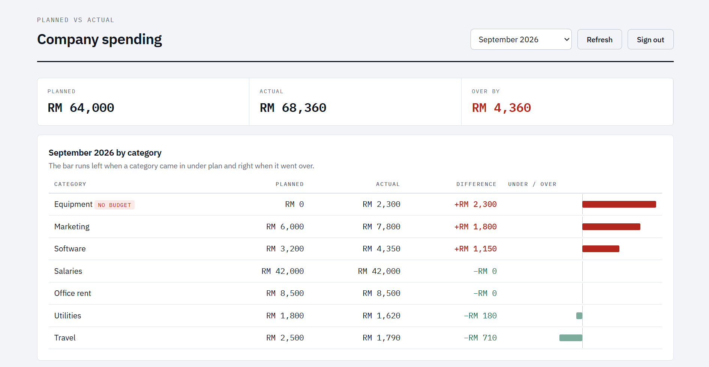
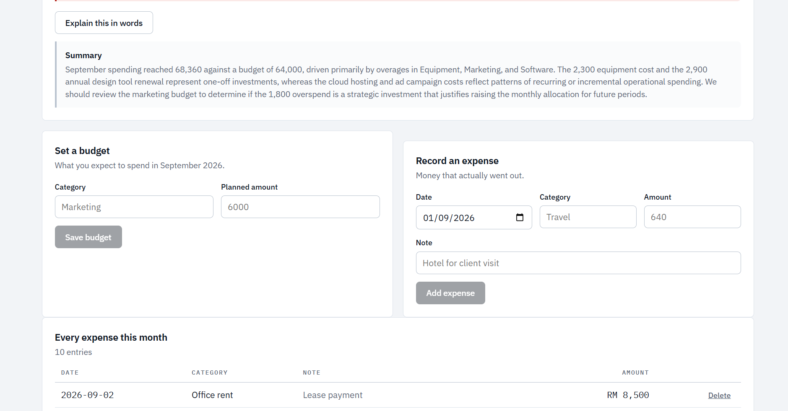

# Spend Tracker

**[Live demo →](https://spendtrack-orcin.vercel.app/)**

Plan what the company will spend each month, record what it actually spends,
then see row by row where the two diverged.



## What it does

- Set a planned budget per category, per month
- Record expenses as they happen, each with a note
- A SQL view computes planned-vs-actual variance — the frontend never does the maths
- An optional written summary reads the expense *notes* and says whether an
  overspend was a one-off renewal or a creeping pattern
- Every account sees only its own rows, enforced by Postgres, not by JavaScript



The summary reads the *notes* on each expense, which is what lets it separate a
one-off annual renewal from a pattern of creeping costs. The numbers alone
cannot tell you that.

## Stack

React 18 · Vite · Supabase (Postgres, Auth, Edge Functions) · deployed on Vercel

## The parts worth looking at

**The arithmetic lives in SQL.** `monthly_variance` is a view doing a full outer
join between budgets and actuals, so a category that was budgeted but never spent
*and* one spent but never budgeted both still appear — which is exactly the
overspend you want a report to catch. React only renders rows.

**The frontend does no access control.** `load()` in `App.jsx` selects everything
and adds no user filter. It doesn't need one: the RLS policies compare `user_id`
against `auth.uid()` taken from the request's token, so the database returns only
your rows no matter what the query asks for.

**Inserts never send a user_id.** The column is declared `default auth.uid()`, so
Postgres stamps the owner itself. The client cannot set it wrong, and cannot set
it to someone else.

**The API key never reaches the browser.** The Gemini call runs inside a Supabase
edge function with the key held in server-side secrets — the browser only ever
sees the finished sentence.

---

## What Supabase is doing here

Coming from PHP + MySQL, the mental swap is:

| You used to write | Supabase equivalent |
|---|---|
| `connect.php` | `src/lib/supabase.js` — one `createClient()` call |
| `get_sessions.php` | `supabase.from('expenses').select()` straight from React |
| `save_session.php` | `supabase.from('expenses').insert()` |
| `delete_session.php` | `supabase.from('expenses').delete().eq('id', id)` |
| `auth_guard.php` | Row Level Security policies, stored in the database |
| `gemini_proxy.php` | An Edge Function (`supabase/functions/analyze`) |

**You do not write a backend.** The database publishes a REST API over your
tables, and the React app calls it directly. What you write instead is the
schema and the security policies — the thinking moves from PHP into SQL.

---

## Setup

### 1. Create the project
Go to [supabase.com](https://supabase.com), create a free project. Pick a
region near you. It takes a minute or two to spin up.

### 2. Create the tables
Open **SQL Editor** in the sidebar, paste the whole of `supabase/schema.sql`,
and hit Run. That creates two tables, a view, the security policies, and some
sample data so the dashboard isn't empty.

Check it worked: **Table Editor** should now show `budgets` and `expenses`.

Then run `supabase/auth-upgrade.sql` the same way. That one adds accounts:
every row gets an owner, and the policies change from "anyone" to "only the
user this row belongs to".

### 3. Get your keys
**Project Settings → API**. Copy the **Project URL** and the **anon public**
key.

Ignore the `service_role` key. That one bypasses all security and belongs
only on a server, never in a browser app.

### 4. Connect the app
```bash
cp .env.example .env
```
Paste the two values into `.env`, then:
```bash
npm install
npm run dev
```
Open the URL it prints. You should see the seeded month with three categories
over budget.

### 5. Use it
Create an account on the sign-in screen first — budgets and expenses are
private per account.

- **Set a budget** — what you expect to spend on a category this month
- **Record an expense** — money that actually went out
- The table and the totals recompute from the database on every change
- Switch months with the dropdown at the top right

### 6. Optional — the AI summary
The "What happened" panel already works without AI: which categories went
over, by how much, and whether one of them accounts for most of the gap.
That's arithmetic, and doing it locally is instant, free, and always right.

The **Explain this in words** button is the part where a model actually adds
something — it reads your expense *notes* and tells you whether an overspend
was one renewal or a creeping pattern.

To enable it you need the Supabase CLI:
```bash
npm install -g supabase
supabase login
supabase link --project-ref YOUR_PROJECT_REF
supabase secrets set GEMINI_API_KEY=your_key_here
supabase functions deploy analyze
```
The key is stored in Supabase's secrets and used server-side. It never
reaches the browser — the same reason `gemini_proxy.php` existed.

Skip this entirely and the app still works; the button just reports that the
function isn't deployed.

### 7. How the data is protected

The browser talks straight to the database using a key that is printed in the
page source. Anyone can read that key. So the key cannot be what protects the
data — the database has to.

That is what Row Level Security does, and it is set up in
`supabase/auth-upgrade.sql`:

```sql
create policy "own expenses only"
  on expenses for all
  to authenticated
  using      (user_id = auth.uid())
  with check (user_id = auth.uid());
```

`auth.uid()` is read from the signed token the browser sends. `using`
decides which rows you may read, update or delete; `with check` decides
which rows you may create. Both compare against the token, which the browser
cannot forge.

Two consequences worth noticing:

**The frontend never filters by user.** Look at `load()` in `App.jsx` —
it selects everything and adds no user condition. It doesn't need one. The
database returns only your rows regardless of what the query asks for.

**Inserts never send a user_id.** The column is declared
`default auth.uid()`, so Postgres stamps the owner itself. The app cannot
set it wrong, and cannot set it to someone else.

The anonymous key is then revoked from both tables entirely, so holding it
gets you a login screen and nothing more.

That's the real lesson of Supabase: security lives in the database, not in
your JavaScript.

---

## Files worth reading

```
supabase/schema.sql              the tables and the variance view
supabase/auth-upgrade.sql        row ownership and the RLS policies
src/components/Auth.jsx          sign in / sign up
src/lib/supabase.js              client setup
src/App.jsx                      all the reads and writes
src/lib/analyse.js               works out what went over budget
src/components/VarianceTable.jsx the row-by-row comparison
supabase/functions/analyze/      the Gemini call, server-side
```

The most interesting file is `schema.sql`. The `monthly_variance` view does
the planned-vs-actual maths in SQL, so the React code never calculates
anything — it just displays rows. Change the maths there and every screen
updates at once.
